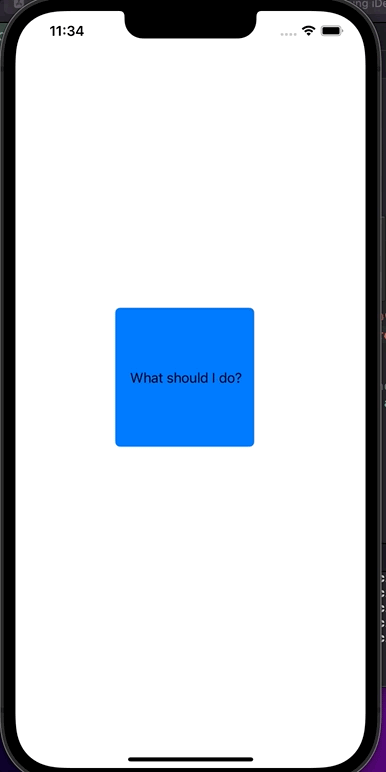

**Modified iDecide Objective-C Project**  
**By: Ariadne Rincon**  

This project was an early assignment in CPSC 411 that aimed to familiarize ourselves with XCode, Objective-C, and the iPhone simulator.    
The original version of this project was presented from our class textbook: Head First iPhone and iPad Development, 2nd Edition by Tracey and Dan Pilone.  
For this assignment we made modifications requested by the professor.  

**Professor Requirements:**  
Modify the iDecide App so that it has 8 POSSIBLE ANSWERS, instead of always saying "Go for it!"  
You will need a random number function, AND
an NSMutableArray of your 8 possible answers.  

**Output of App**

